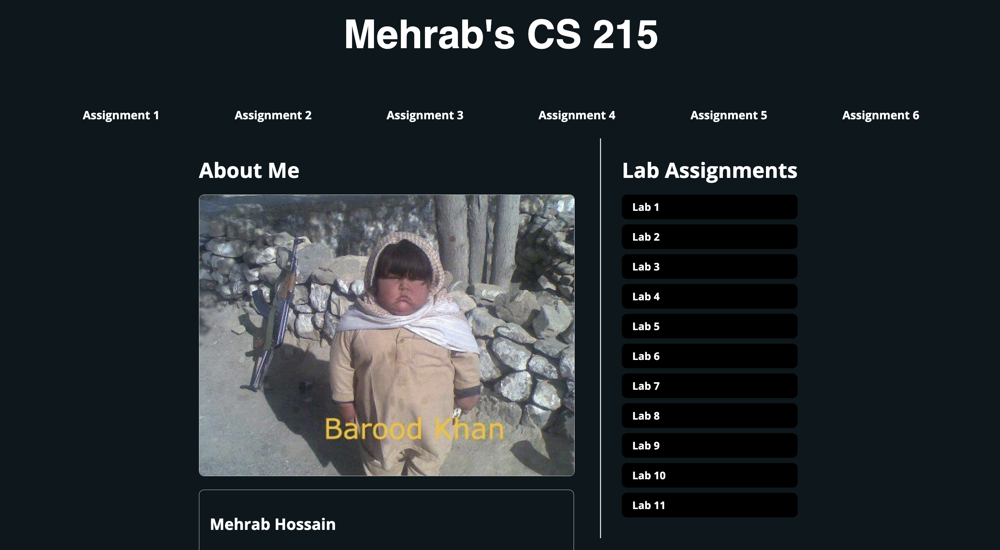
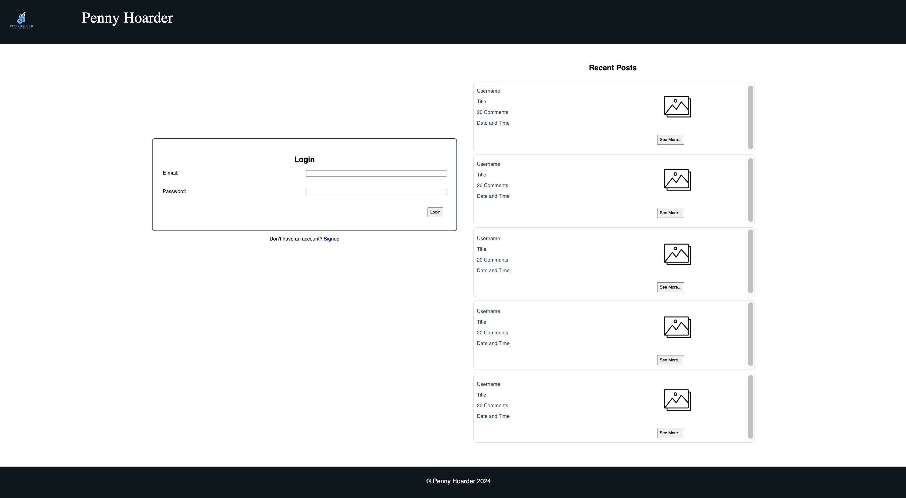
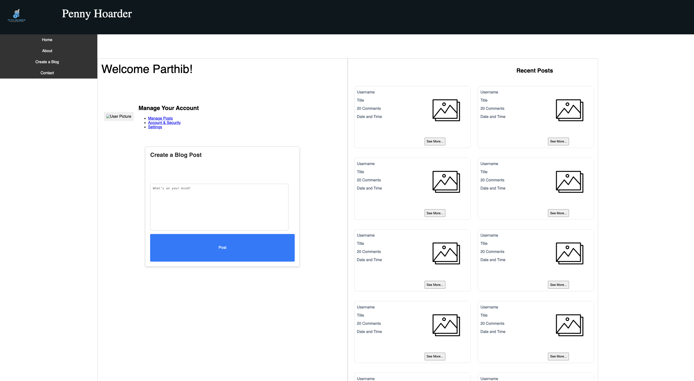
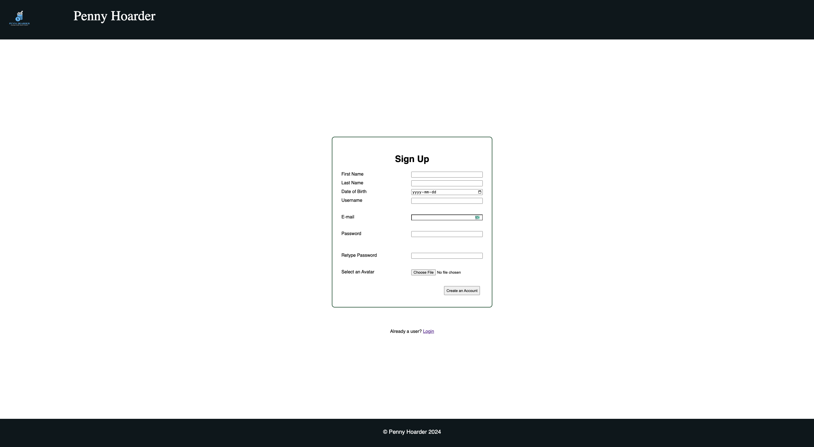
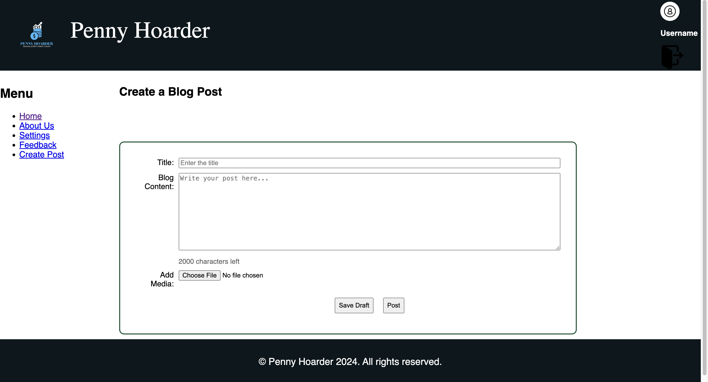
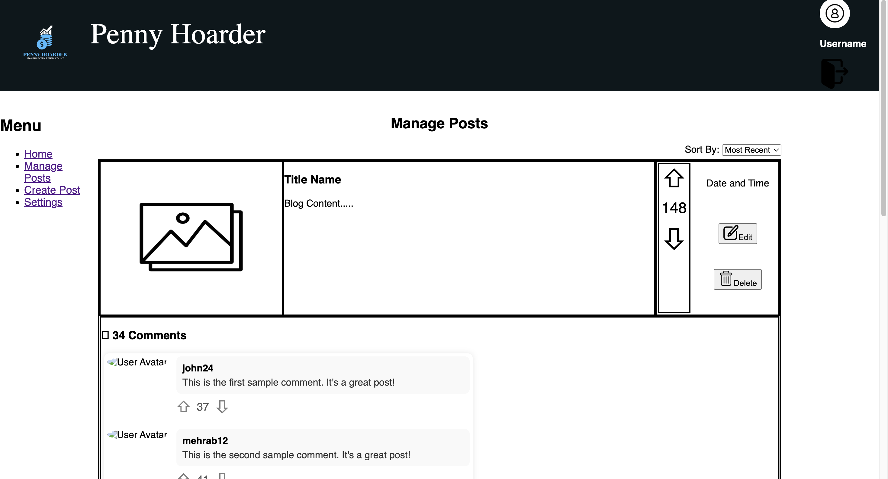

# <a name="uofr-cs215">🎓 CS 215 | Web and Database Programming 🎓</a>
```
http://www.webdev.cs.uregina.ca/~mhf255/
```
### This website hosts all the projects for this class



---


# 📰 Final Assignment (6) | QnA Website
This website allows users to create an account, login, post blogs and answers.

## Features
```
Using: HTML | CSS | AJAX | JavaScript | PHP | SQL
```
 * User account creation, user data stored in databse
 * URL manipulation handlers
 * Web data auto refresh
 * Input sanitation
 * Other low level sanitation
<br>


  ## Home Page | Before Login:
  

  ## Home Page | After Login
  

  ## Signup Page:
  

  ## Blog Creation Page
  

  ## Post Management Page
  

  

  [back to top](#uofr-cs215)
